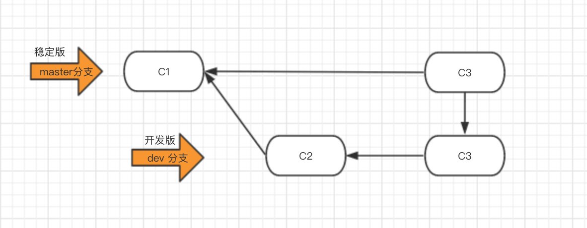
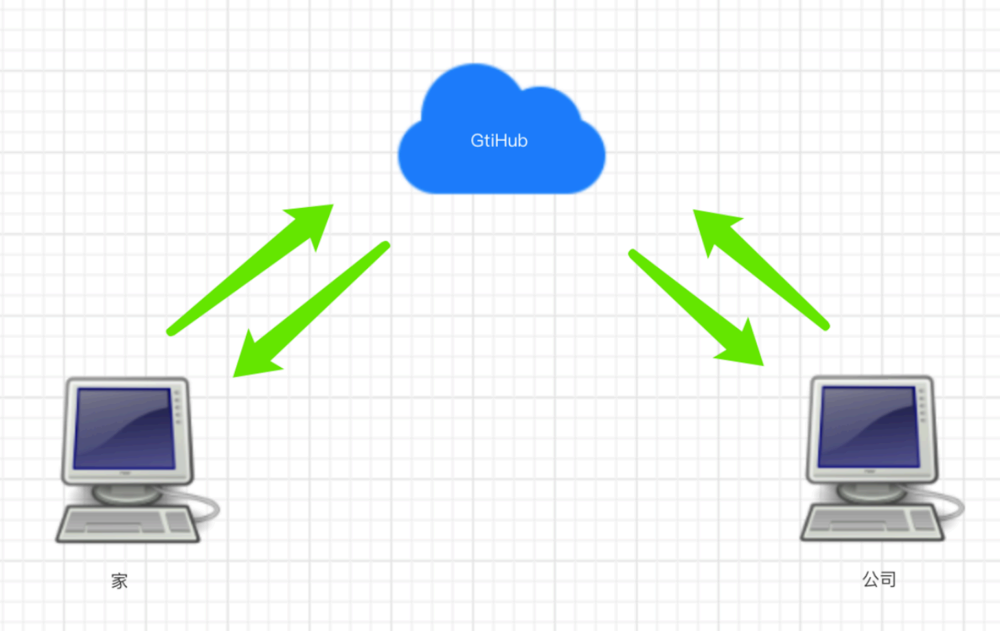

# Git实战

听故事顺便学Git，可能是全世界最好玩的Git教程

哔哩哔哩地址：https://www.bilibili.com/video/BV1JZ4y1g7YK?p=1

## 第一章 快速入门

### 1.1 什么是Git

Git是一个分布式的版本控制软件。

* 软件，类似于QQ，office，dota等安装到电脑上才能使用的工具。
* 版本控制，类似于毕业论文、写文案、视频剪辑等，需要反复修改和保留原历史数据。
* 分布式
  * 文件夹拷贝
  * 本地版本控制
  * 集中式版本控制
  * 分布式版本控制

### 1.2为什么要做版本控制

要保留之前所有的版本，以便回滚和修改

### 1.3安装git

详见：https://git-scm.com/book/zh/v2/%E8%B5%B7%E6%AD%A5-%E5%AE%89%E8%A3%85-Git

## 第二章“东北热“创业史

### 2.1第一阶段：单枪匹马开始干

想要让git对一个目录进行版本控制需要以下步骤：

* 进入要管理的文件夹

* 执行初始化命令

  ~~~git
  git init
  ~~~

* 管理目录下的文件状态

  ~~~git
  git status
  (注：新增的文件和修改过的文件都是红色)
  ~~~

* 管理指定文件（红变绿）

  ~~~git
  git add [文件名]  #添加单个需要管理的文件
  git add .        #添加该文件夹下所有文件
  ~~~

* 个人信息配置：用户名、邮箱（第一次使用时需要配置）

  ~~~git
  git config --global user.email "you@example.com"
  git config --global user.email "Your Name"
  ~~~

* 生成版本

  ~~~git
  git commit -m '描述信息'
  ~~~

* 查看版本记录

  ~~~git 
  git log
  ~~~

### 2.2 第二阶段：拓展新功能（添加短视频板块）

~~~git
git add .
git commit -m '短视频'  #（拓展新功能后再次上传版本）
~~~

### 2.3 第三阶段：拓展新功能（添加约饭板块）

新板块上线后受到有关部门管制，要求下线该功能，因此需要做相关修改

* 回滚至之前版本

~~~git 
git log #查看版本信息列表
git reset --hard [版本号]
~~~

* 回滚至之后版本

~~~git
git reflog
git reset --hard [版本号]
~~~

### 小结

~~~git
git init    #初始化
git add .   #添加管理
git commit [版本号]  #生成版本
git log    #查看历史版本
git reflog #查看后期版本
git reset --hard [版本号] 
~~~

### 2.5 第四阶段：开发商城功能&紧急修复bug

#### 2.5.1 分支

​    分支可以给使用者多个环境，意味着你可以把你的工作从开发主线上分离开来，以免影响开发主线。

#### 2.5.2 紧急修复bug方案

#### 2.5.3 命令总结

* 查看分支

~~~git
git branch
~~~

* 创建分支

~~~git 
git branch [分支名称]
~~~

* 切换分支

~~~git
git checkout [分支名称]
~~~

* 合并分支（可能产生冲突）

~~~git
git merge [需要合并的分支] #需要切换到主分支或其他分支
~~~

* 删除分支

~~~git
git branch -d [分支名称]
~~~

#### 2.5.4 工作流

### 2.6 第五阶段：进军三里屯

有钱之后就要造作，一个人在三里屯买了一层楼坐办公室。

#### 2.6.1 第一天上班前在家上传代码

​       需要注册github账号，并创建远程仓库，然后再执行如下命令，将代码上传到github。

~~~git
git remote add origin [远程仓库地址]  #给远程仓库起别名
git push -u origin [分支]
~~~

#### 2.6.2 初次在公司新电脑下载代码

* 克隆远程仓库代码

~~~git
git clone [远程仓库地址]  #内部已经实现 git remote add origin 远程仓库地址
~~~

* 切换分支

~~~git
git checkout [分支]
~~~

在公司下载完代码后继续开发

* 切换到dev分支进行开发

~~~git
git checkout dev
~~~

* 把master分支合并到dev[仅一次] （保持是最新代码）

~~~git
git merge master
~~~

* 修改代码
* 提交代码

~~~git
git add .
git commit -m 'xxx'
git push origin dev 
~~~

#### 2.6.3 下班回家继续写代码

* 切换到dev分支进行开发

~~~git
git checkout dev
~~~

* 拉代码

~~~git
git pull origin dev
~~~

* 继续开发

* 提交代码

~~~git
git add .
git commit -m 'xxx'
git push origin dev
~~~

#### 2.6.4 到公司继续开发

* 切换到dev分支进行开发

~~~git 
git checkout dev
~~~

* 拉取最新代码（不必再clone，只需要通过pull获取最新代码即可）

~~~git
git pull origin dev
~~~

* 继续开发

* 提交代码

~~~git
git add .
git commit -m 'xxx'
git push origin dev
~~~

开发完毕，要上线

* 将dev分支合并到master，并进行上线

~~~git
git checkout master
git merge dev
git push origin master
~~~

* 把dev分支也推送到远程

~~~git
git checkout dev 
git merge master
git push origin dev
~~~

#### 2.6.5 在公司约妹子忘记提交代码

* 

